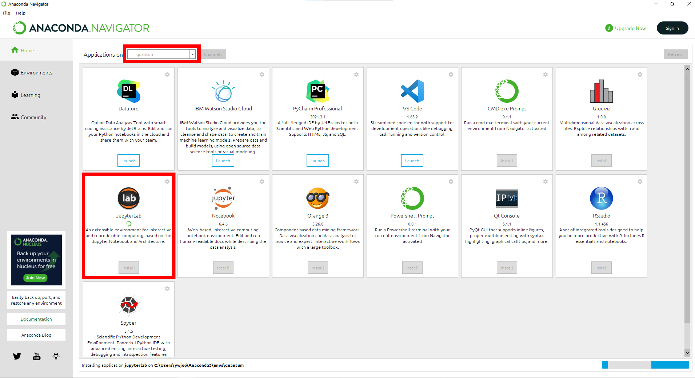
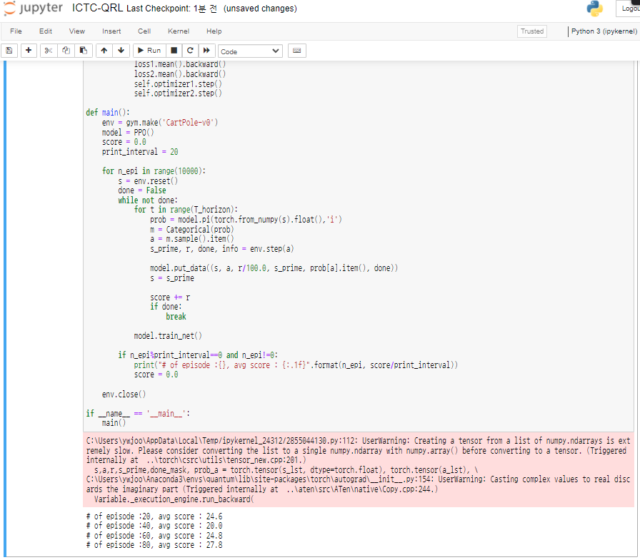

# QuantumRL_Env_Pennylane
This repo. is for quantum RL developer. We use pennylane library as dev. env.

1. Download and install Anaconda. [Link](https://www.anaconda.com/products/individual).


2. Open "Anaconda Prompt (Anaconda3)" and create virtual environment. 


```bash 
conda create -n quantum python=3.9 
```
  
  
3. Activate "quantum" environment
  
  
```bash 
conda activate quantum 
```
  
  
4. Install pennylane & gym & torch 
  
```bash 
pip install pennylane 
pip install gym
conda install pytorch torchvision torchaudio cpuonly -c pytorch
```
  
5. Open "Anaconda Navigator", set "Applications on quantum", and install "jupyterlab"
 

6. Execute "ICTC-QRL.ipynb"

